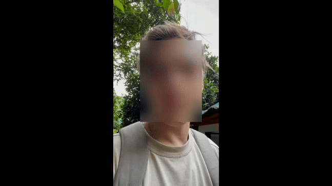

# Руководство по использованию проекта Face Detection

## Описание проекта
Face Blurring - это инструмент для обработки видео, написанный на Python с использованием библиотеки PyTorch и OpenCV. Проект использует предварительно обученную модель MTCNN для обнаружения лиц в видео и применяет эффект блюра к найденным лицам.

## Используемые технологии
- [PyTorch](https://pytorch.org/): Библиотека для глубокого обучения, используемая для работы с нейронной сетью MTCNN.
- [OpenCV](https://opencv.org/): Библиотека для компьютерного зрения, применяемая для обработки видео и реализации эффекта блюра.
- [facenet-pytorch](https://github.com/timesler/facenet-pytorch): Библиотека для обнаружения лиц и точек на лице, включая предварительно обученную модель MTCNN.

## Установка
1. Установите зависимости: `pip install torch opencv-python torchvision facenet-pytorch`
2. Клонируйте репозиторий: `git clone https://github.com/AlexanderGithubProfile/face_bluring.git`
3. Перейдите в директорию проекта: `cd face_bluring`

## Запуск
1. Замените переменную `video_path` на путь к вашему видео в коде.
2. Запустите приложение: `python main.py`
3. Видео с лицами, на которых применен эффект блюра, будет сохранено в файл `output_blurred.mp4`.

## Конфигурация
Настройки блюра, такие как размер и степень размытия, могут быть адаптированы в коде.

## Вклад в проект
Если у вас есть предложения или исправления, не стесняйтесь делать pull request.

## Лицензия
Этот проект распространяется под лицензией MIT - подробности смотрите в файле [LICENSE](LICENSE).

